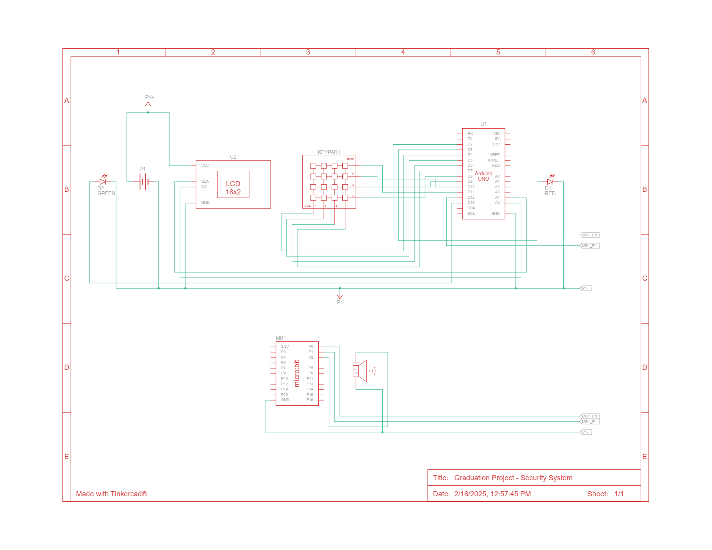

# 🔒 Security System using Arduino & Micro:Bit

## 📌 Project Overview
This project implements a **password-protected security system** using **Arduino Uno** and **Micro:Bit** to **control access and detect intrusions**. It features a **4x4 keypad, LCD display, buzzer alarm, and LED indicators** to provide real-time feedback. The system locks down after three incorrect attempts and triggers an alarm.

---

## 🚀 Features
✔ **User Authentication** – Secure password entry using a **4x4 keypad**  
✔ **LCD Display** – Real-time status updates (access granted, denied, or system locked)  
✔ **Intrusion Alarm** – System locks after **three failed attempts** and triggers an alert  
✔ **Micro:Bit Integration** – Detects external breaches and triggers **buzzer & LED alerts**  
✔ **Hardware-Software Integration** – Efficient **C++ for Arduino & MicroPython for Micro:Bit**  
✔ **Simulated in Tinkercad** – Designed and tested before implementation  

---

## 🛠️ Hardware Components  
- **Arduino Uno R3**  
- **Micro:Bit**  
- **4x4 Keypad**  
- **LCD 16x2 (I2C)**  
- **Buzzer**  
- **LED Indicators (Red & Green)**  
- **Resistors & Jumper Wires**  

---

## 📜 Code Overview  
### **1️⃣ Arduino Code (C++)**  
- Handles **password verification, LCD updates, and alarm activation**  
- Manages **access control and user authentication**  

### **2️⃣ Micro:Bit Code (Python)**  
- Detects **external triggers (e.g., motion or tampering)**  
- Controls **LED patterns and buzzer alerts**  

---

## 🔧 How It Works  
1️⃣ The user enters a **4-digit password** via the **4x4 keypad**.  
2️⃣ If the password is **correct**, the **green LED** turns on, granting access.  
3️⃣ If incorrect, the **red LED** blinks, and remaining attempts are displayed.  
4️⃣ After **three failed attempts**, the system **locks and triggers an alarm**.  
5️⃣ The **Micro:Bit monitors external activity** and **activates alerts if triggered**.  

---

## 📷 Circuit Diagram  
  

---
